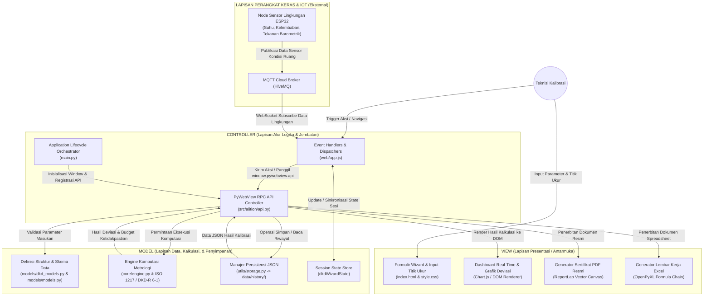

# Perancangan Arsitektur Perangkat Lunak Berbasis Model-View-Controller (MVC)
## Sistem Kalibrasi Digital Presisi Tinggi Alition Pro (DKD-R 6-1)

---

## 1. Pendahuluan & Konsep Arsitektur

Dalam perancangan perangkat lunak sistem kalibrasi industri **Alition Pro**, diterapkan pola arsitektur **Model-View-Controller (MVC)** berbasis *Desktop-Web Hybrid*. Pendekatan ini memadukan keandalan komputasi numerik bahasa pemrograman Python pada sisi *backend* dengan keluwesan antarmuka grafis modern berbasis web (HTML5, CSS3, dan JavaScript) yang dibungkus menggunakan runtime desktop *PyWebView*.

Pemisahan tanggung jawab (*Separation of Concerns*) pada arsitektur ini membagi sistem ke dalam tiga lapisan utama:
1. **Model (M)**: Mengelola struktur data, aturan validasi metrologi, kalkulasi ketidakpastian pengukuran (DKD-R 6-1 & ISO 1217), serta persistensi data riwayat pengujian.
2. **View (V)**: Menyajikan antarmuka interaktif kepada teknisi (operator), menampilkan grafik deviasi secara *real-time*, serta men-generate laporan sertifikat fisik (PDF dan Excel).
3. **Controller (C)**: Bertindak sebagai koordinator alur logika dan jembatan komunikasi (*RPC Bridge*) antara input pengguna dari antarmuka visual dengan fungsi komputasi dan penyimpanan di backend.

---

## 2. Diagram Arsitektur MVC Sistem

---

## 3. Rincian Komponen Setiap Lapisan (Layer Breakdown)

### A. Lapisan Model (Model Layer)
Lapisan Model sepenuhnya independen dari antarmuka grafis. Model bertanggung jawab menjaga integritas data dan mengeksekusi perhitungan metrologi secara deterministik.

1. **Definisi Entitas dan Skema Data (`models/dkd_models.py` & `models/models.py`)**:
   * Mendefinisikan struktur objek data kalibrasi, mencakup: metadata instrumen (*Tag Number*, *Serial Number*, *Manufacturer*), konfigurasi alat standar acuan (*Digital Calibrator* atau *Deadweight Tester*), serta tabel data pengukuran naik-turun (*staircase cycles*).
   * Menjamin bahwa setiap data masukan memenuhi batas toleransi (*typesafe validation*) sebelum diproses lebih lanjut.

2. **Mesin Komputasi Metrologi (`core/engine.py` & Modul DKD-R 6-1)**:
   * **Kalkulasi Densitas Udara ISO 1217**: Menghitung tekanan saturasi, tekanan uap air, tekanan udara kering, dan densitas udara ambien aktual berdasarkan suhu ruang, kelembaban relatif, dan tekanan atmosfer.
   * **Koreksi Ketinggian Fluida (Head Correction)**: Mengoreksi perbedaan elevasi antara sensor acuan dan alat uji (UUT).
   * **Evaluasi Anggaran Ketidakpastian (Uncertainty Budget)**:
     * Ketidakpastian standar acuan (u_std).
     * Ketidakpastian daya baca / resolusi (u_res).
     * Ketidakpastian deviasi titik nol (u_f0).
     * Ketidakpastian histeresis (u_h).
     * Ketidakpastian repetibilitas (u_b') dan reproduktibilitas (u_b).
     * Ketidakpastian gabungan (u_c) dan ketidakpastian diperluas (U) pada tingkat kepercayaan 95% (k=2).
   * **Penetapan Kelayakan**: Memvalidasi kepatuhan instrumen terhadap batas kesalahan yang diizinkan (*Maximum Permissible Error* / MPE) dengan kriteria: `|Error| + U <= MPE`.

3. **Manajer Persistensi Data (`utils/storage.py`)**:
   * Menyimpan sesi kalibrasi final ke dalam file berformat JSON di direktori terproteksi `data/history/`.
   * Melakukan serialisasi dan deserialisasi data riwayat untuk fungsi audit, pencarian riwayat (*history search*), dan komparasi instrumen.

---

### B. Lapisan View (View Layer)
Lapisan View berfokus pada penyajian informasi visual kepada teknisi serta menghasilkan keluaran (*deliverables*) formal.

1. **Antarmuka Grafis Desktop Web (`web/index.html` & `web/style.css`)**:
   * Menyediakan formulir masukan data bertahap (*Wizard Flow*): Metadata -> Parameter Setup -> Verifikasi Pra-Uji (Preloading) -> Titik Ukur -> Hasil Akhir.
   * Menampilkan visualisasi status kelulusan instrumen secara jelas menggunakan badge visual (*PASS* / *FAIL*).

2. **Visualisasi Data Dinamis (`web/app.js` UI Modules)**:
   * Menggambar kurva kalibrasi (tekanan aktual vs nominal) dan kurva deviasi histeresis menggunakan grafik kanvas secara reaktif.
   * Menampilkan telemetri kondisi lingkungan (suhu dan kelembaban ruang) secara *live* melalui *WebSocket listener*.

3. **Generator Sertifikat dan Laporan Ekspor (`utils/dkd_reporting.py`)**:
   * **Document View PDF**: Memanfaatkan pustaka `ReportLab` dengan sistem *two-pass canvas* (`NumberedCanvas`) untuk menghasilkan sertifikat resmi berstandar industri dengan format halaman dinamis, tabel vektor bergaris ganda, dan tata letak sertifikat halaman tunggal maupun multihalaman.
   * **Document View Excel**: Memanfaatkan pustaka `openpyxl` untuk menghasilkan buku kerja spreadsheet 6-sheet (*Setup*, *Calculation Sheet*, *Certificate Table 1*, *Uncertainty Budget Table 2*, *Raw Measurements*, dan *Summary KPI*) dengan rantai formula matematika aktif dan tata warna profesional *Warm Corporate Taupe*.

---

### C. Lapisan Controller (Controller Layer)
Lapisan Controller berperan mengendalikan interaksi sistem, menerima perintah, mengarahkan data ke Model, dan memicu pembaruan pada View.

1. **PyWebView Bridge API (`src/alition/api.py` - Class `Api`)**:
   * Merupakan *Central Controller* di lingkungan Python.
   * Menyediakan antarmuka RPC yang dapat dipanggil langsung dari JavaScript melalui objek global `window.pywebview.api`.
   * Mengatur operasi kritis:
     * `save_session(payload)`: Menerima data dari UI, memvalidasi skema, dan memerintahkan Model untuk menyimpan data.
     * `export_pdf(payload)` & `export_excel(payload)`: Mengambil data sesi dan memerintahkan View Generator untuk memproduksi berkas fisik.
     * `get_history()`: Membaca riwayat dari Model dan menyuplaikannya kembali ke View.
     * `provision_hardware()` & `test_mqtt()`: Mengatur komunikasi dengan perangkat keras kalibrator.

2. **Event Handlers dan Router Sisi Klien (`web/app.js`)**:
   * Menangkap interaksi DOM (klik tombol, perubahan input, pemilihan sekuens kalibrasi).
   * Melakukan validasi awal pada form masukan sebelum data diserahkan ke *backend controller*.
   * Mengatur navigasi antar tab antarmuka (Workspace, History, Hardware Provisioning, Compare Mode).

3. **Inisialisator Siklus Hidup Aplikasi (`main.py`)**:
   * Bertindak sebagai *Application Entry Controller*.
   * Menginisialisasi jendela aplikasi desktop, menyematkan instansiasi kelas `Api` ke runtime PyWebView, dan memuat view awal `index.html`.

---

## 4. Matriks Pemetaan File Proyek ke Arsitektur MVC

| Lapisan MVC | Nama File / Modul | Deskripsi Tanggung Jawab |
| :--- | :--- | :--- |
| **Model** | `src/alition/models/dkd_models.py` | Model data dan skema sesi kalibrasi standar DKD-R 6-1. |
| **Model** | `src/alition/models/models.py` | Model data sesi default dan konfigurasi dasar instrumen. |
| **Model** | `src/alition/core/engine.py` | Algoritma komputasi metrologi, histeresis, dan rumus ketidakpastian. |
| **Model** | `src/alition/utils/storage.py` | Mekanisme persistensi berkas JSON riwayat kalibrasi di `data/history/`. |
| **View** | `src/alition/web/index.html` | Struktur dokumen antarmuka grafis desktop. |
| **View** | `src/alition/web/style.css` | Sistem desain visual, tipografi, warna, dan tata letak antarmuka. |
| **View** | `src/alition/utils/dkd_reporting.py` | Generator dokumen sertifikat formal dalam format PDF dan Excel. |
| **View** | `src/alition/web/app.js` (DOM & Chart Logic) | Fungsi perender elemen tabel, grafik regresi, dan notifikasi UI. |
| **Controller** | `src/alition/api.py` (`class Api`) | Controller utama jembatan RPC backend antara UI dan Model. |
| **Controller** | `src/alition/web/app.js` (Event Handlers) | Controller frontend pengatur alur kerja wizard dan penangkap event pengguna. |
| **Controller** | `main.py` | Orchestrator startup aplikasi dan pengelola lifecycle PyWebView window. |

---

## 5. Alur Data Transaksional (End-to-End Workflow)

Sebagai contoh alur kerja MVC saat teknisi menyelesaikan sesi kalibrasi dan mengekspor sertifikat:

1. **Input (View -> Controller)**:
   Teknisi mengisi titik ukur dan menekan tombol *Export PDF* pada View (`index.html`). Event listener pada `app.js` (Frontend Controller) menangkap event tersebut dan memanggil fungsi asynchronous `window.pywebview.api.export_pdf(payload)`.

2. **Pemrosesan (Controller -> Model)**:
   Kelas `Api` pada `src/alition/api.py` (Backend Controller) menerima payload JSON. Data dialirkan ke `DkdReportingModule` untuk memvalidasi angka-angka metrologi terhadap skema Model.

3. **Kalkulasi & Verifikasi (Model)**:
   Model mengevaluasi ulang rumus ketidakpastian, batas MPE, dan kalkulasi densitas udara ambien ISO 1217 untuk memastikan tidak ada anomali matematis.

4. **Output Rendering (Model -> Controller -> View)**:
   Setelah komputasi valid, modul pelaporan pada View (`dkd_reporting.py`) mengonstruksi dokumen PDF dua pass beresolusi tinggi dan menyimpannya ke direktori target yang dipilih teknisi.

5. **Umpan Balik (Controller -> View)**:
   Backend Controller mengembalikan pesan sukses (*response promise*) ke `app.js`, yang kemudian memicu View untuk menampilkan notifikasi dialog sukses dan membuka folder hasil export secara otomatis.

---

## 6. Keuntungan Penerapan Arsitektur MVC pada Tugas Akhir Ini

1. **Modularitas dan Kemudahan Perawatan (Maintainability)**:
   Perubahan pada antarmuka visual (misalnya perubahan tata letak form atau penyesuaian tema CSS) dapat dilakukan tanpa risiko merusak rumus perhitungan metrologi di lapisan Model.
2. **Kepatuhan Standar Industri (Standards Compliance)**:
   Logika perhitungan DKD-R 6-1 dan ISO 1217 terisolasi secara murni pada lapisan Model, memudahkan pengujian validasi akurasi numerik (*unit testing*) secara terpisah dari GUI.
3. **Fleksibilitas Integrasi Hardware (Extensibility)**:
   Penambahan jenis sensor lingkungan baru (ESP32 / IoT) atau perubahan protokol komunikasi (MQTT / Serial USB) hanya memengaruhi antarmuka masukan di sisi Controller/Model tanpa mengacaukan desain antarmuka pengguna.
